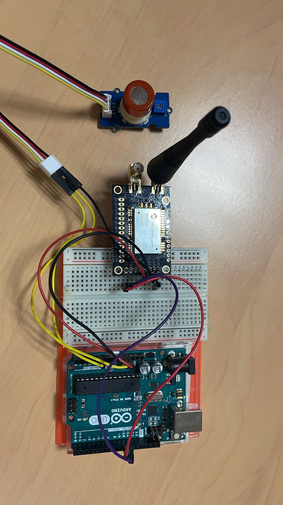

# 2023_2024_mini_project_Junjiang_Thang_Stephane

## Introduction<a name="p1"></a>
Following the production of the AIME laboratory gas sensor, we aim to develop a system using an ESP32 microcontroller. This system will be designed to gather data from the sensor and transmit the detection of a specific gas to a server via a LoRA module.
Our projects mainly include：
 - The Arduino code for sensors to collect data
 - The PCB shield and KiCad project content
 - The Node-Red to display the dashboard
 - The Datasheet for the sensor

Here is a picture of our circuit: <br>
 <br>

## LoRa<a name="p2"></a>
The code in the directory Piste_Verte is a key component of our project, enabling wireless communication over long distances with low power consumption.

<details>
 <summary><b>Pin Configuration</b></summary>
 
```c++
#define rxPin 10
#define txPin 11
```
rxPin and txPin are defined for the serial connection to the LoRa module, allowing for data transmission and reception.
</details>

<details>
 <summary><b>Serial Communication Setup</b></summary>
 
```c++
#define debugSerial Serial
SoftwareSerial mySerial = SoftwareSerial(rxPin, txPin);
#define loraSerial mySerial
```
A virtual serial port (loraSerial) is created for communication with the LoRa module, using the defined rxPin and txPin. The built-in Serial port is used for debugging.
</details>

<details>
 <summary><b>LoRaWAN Configuration</b></summary>
 
```c++
#define freqPlan TTN_FP_EU868
TheThingsNetwork ttn(loraSerial, debugSerial, freqPlan);
```
The frequency plan for LoRaWAN communication is set to TTN_FP_EU868 which is suitable for Europe. The TheThingsNetwork object is initialized with the LoRa and debug serial connections.
</details>

<details>
 <summary><b>TTN Credentials</b></summary>
 
```c++
const char *appEui = "6aadd25252dc20ea";
const char *appKey = "2827F5D8991A743B42BEB51F297AD80A";
```
</details>

<details>
 <summary><b>Data Structure</b></summary>
 
```c++
devicedata_t data = api_DeviceData_init_default;
```
A devicedata_t object is created to structure the sensor data before transmission.
</details>

<details>
 <summary><b>Setup Function</b></summary>
 
```c++
void setup() { ... }
```
In setup(), serial communications are initialized, the LoRa module's status is displayed, and the device attempts to join TTN using the provided credentials.
</details>

<details>
 <summary><b>Main Loop</b></summary>
 
```c++
void loop() { ... }
```
The loop() function reads sensor data, encodes it into bytes, and sends it to TTN every 2 seconds.
</details>

<details>
 <summary><b>Message Reception Function</b></summary>
 
```c++
void message(const uint8_t *payload, size_t length, port_t port) { ... }
```
This function handles incoming messages from TTN, decoding them for ports 100 or higher.
</details>

You can also find the codes:
- [RN2483.ino](https://github.com/JunjiangGuo/2023_2024_mini_project_Junjiang_Thuang_Stephane/blob/master/Piste_Verte/RN2483.ino)
