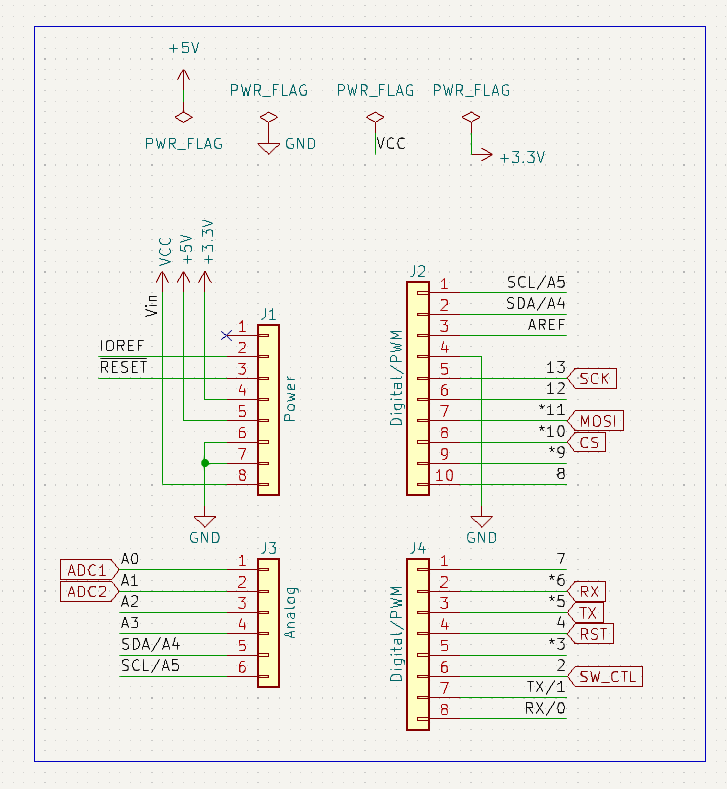
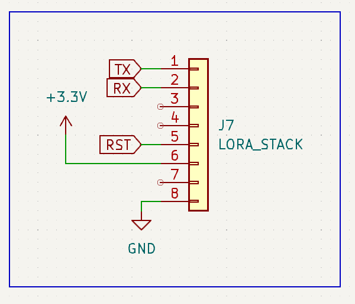
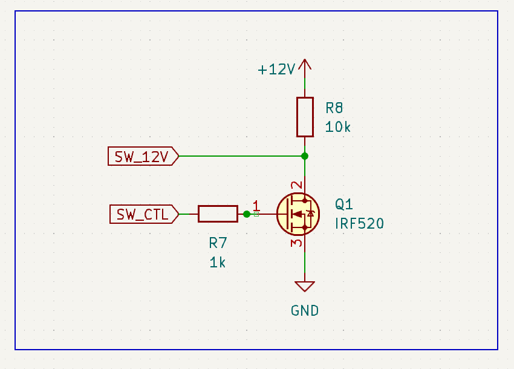
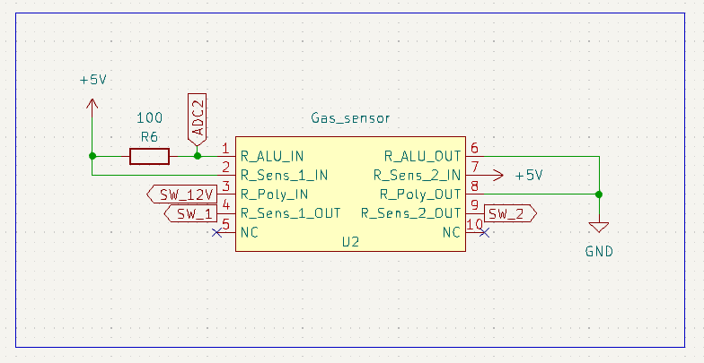
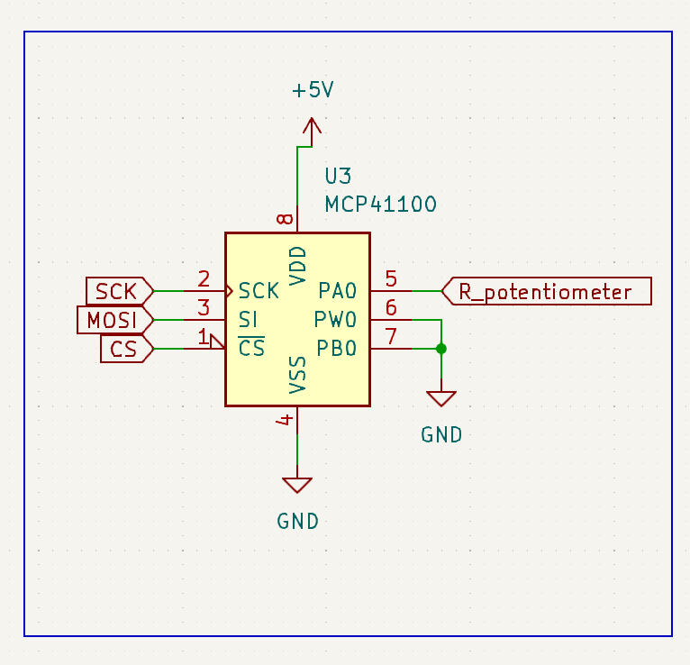
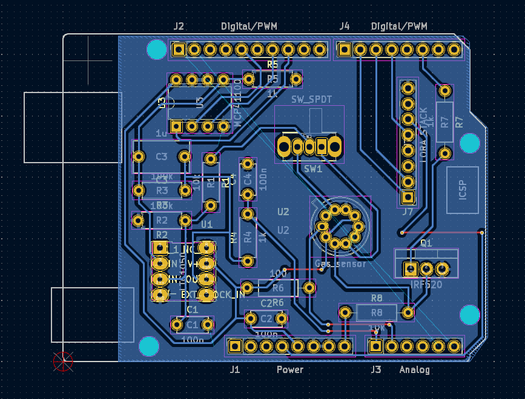

# 2023_2024_mini_project_Junjiang_Thang_Stephane


## Introduction<a name="p1"></a>
Following the production of the AIME laboratory gas sensor, we aim to develop a system using an ESP32 microcontroller. This system will be designed to gather data from the sensor and transmit the detection of a specific gas to a server via a LoRA module.
Our projects mainly include：
 - The Arduino code for sensors to collect data
 - The PCB shield and KiCad project content
 - The Node-Red to display the dashboard
 - The Datasheet for the sensor

Here is a picture of our circuit: <br>
 <br>

## LoRa<a name="p2"></a>
The code in the directory Piste_Verte is a key component of our project, enabling wireless communication over long distances with low power consumption.

<details>
 <summary><b>Pin Configuration</b></summary>
 
```c++
#define rxPin 10
#define txPin 11
```
rxPin and txPin are defined for the serial connection to the LoRa module, allowing for data transmission and reception.
</details>

<details>
 <summary><b>Serial Communication Setup</b></summary>
 
```c++
#define debugSerial Serial
SoftwareSerial mySerial = SoftwareSerial(rxPin, txPin);
#define loraSerial mySerial
```
A virtual serial port (loraSerial) is created for communication with the LoRa module, using the defined rxPin and txPin. The built-in Serial port is used for debugging.
</details>

<details>
 <summary><b>LoRaWAN Configuration</b></summary>
 
```c++
#define freqPlan TTN_FP_EU868
TheThingsNetwork ttn(loraSerial, debugSerial, freqPlan);
```
The frequency plan for LoRaWAN communication is set to TTN_FP_EU868 which is suitable for Europe. The TheThingsNetwork object is initialized with the LoRa and debug serial connections.
</details>

<details>
 <summary><b>TTN Credentials</b></summary>
 
```c++
const char *appEui = "6aadd25252dc20ea";
const char *appKey = "2827F5D8991A743B42BEB51F297AD80A";
```
</details>

<details>
 <summary><b>Data Structure</b></summary>
 
```c++
devicedata_t data = api_DeviceData_init_default;
```
A devicedata_t object is created to structure the sensor data before transmission.
</details>

<details>
 <summary><b>Setup Function</b></summary>
 
```c++
void setup() { ... }
```
In setup(), serial communications are initialized, the LoRa module's status is displayed, and the device attempts to join TTN using the provided credentials.
</details>

<details>
 <summary><b>Main Loop</b></summary>
 
```c++
void loop() { ... }
```
The loop() function reads sensor data, encodes it into bytes, and sends it to TTN every 2 seconds.
</details>

<details>
 <summary><b>Message Reception Function</b></summary>
 
```c++

void message(const uint8_t *payload, size_t length, port_t port) { ... }
```

This function handles incoming messages from TTN, decoding them for ports 100 or higher.
</details>

You can also find the codes:
- [RN2483.ino](https://github.com/JunjiangGuo/2023_2024_mini_project_Junjiang_Thuang_Stephane/blob/master/Piste_Verte/RN2483.ino)

### AIME Sensor
The sensor made at AIME has the following schematics:


There are 10 pins, which are:
- Two N.C. 
- The heating resistor (up to 20V).
- The temperature sensor.
- The gas sensors themselves (2 of them, so we could theorically have two areas for detecting and evene detect different gases).

 ## Circuit amplifier
  The conductance of sensor we use is very low (around ten nS) and is powered by a direct voltage of 12V. The sensor amplifier circuit must then be able to extract information from a very low current signal.
  In this project, we decided to use a transimpedance assembly consisting of an operational amplifier (AOP) to provide a sufficient voltage signal to the analog-to-digital converter (ADC) of an Arduino UNO board.
 
   Our signal is sensitive to amplifier voltage drifts. Our AOP must therefore have a very low input voltage offset so that it cannot distort the signal supplied to the ADC. This restricts our choice of operational amplifier. By shunting this current through a 100 kΩ resistor, the voltage signal supplied to the AOP is 5 mV. For comparison, the [LM741](https://www.ti.com/lit/ds/symlink/lm741.pdf) amplifier has a typical input offset of 1 mV, up to 5 mV. This component is therefore not suitable for our use. So our amplifier must specifically have a low input offset. For this reason, we use the [LTC1050](https://www.analog.com/media/en/technical-documentation/data-sheets/1050fb.pdf), for its drift voltage of 5 µV, or 1000 times weaker than our nominal signal of 5 mV.
> 
 > From this AOP, we develop the architecture of the amplifier circuit. The latter has three filtering stages:
  > - at the input, a low-pass filter (R1C1) with a cutoff frequency of 16 Hz filters current noise on the input signal
  > - another 1.6 Hz low pass filter (R3C2) coupled to the AOP makes it possible to filter the noise component at 50 Hz coming from the electrical network
  > - at the amplifier output, a final filter (R4C4) of 1.6 kHz is used to process noise due to ADC sampling

<div class="row" align="center">
    
    </div>
Figure 1a - Transimpedance amplifier circuit. The *Sensor* resistor represents the strain gauge.

> Capacitance C3 is used to filter irregularities in the amplifier supply voltage. Resistor R2 is used to calibrate the amplifier to the desired voltage range, which is that of the ADC of the microcontroller. During the circuit prototyping phase, we used a digital potentiometer in place of this resistor to find its value. Finally, resistor R5 protects the AOP against electrostatic discharges and constitutes an RC filter with capacitance C1 for voltage noise.

> <div class="row" align="center">
   > 
   > </div>
**Figure 1b - AC simulation of the amplifier circuit. The cutoff frequencies at 1.6 Hz, 16 Hz and 1.6 kHz of the three cascaded filters are visible. This simulation allows us to check the frequency operation of our circuit.**

> To verify the normal operation of the circuit on LTSpice, we simulate the deformation of the gauge by an input voltage pulse (Figure 2). This voltage pulse generates a variation in the current at the AOP input. Virtually, this represents the change in conductance of the gauge due to its deformation. For this simulation, we vary the conductance from 5 nS to 20 nS, which corresponds to the order of magnitude of the resistive gauges used. In doing so, we scan roughly the entire range of possible input signals:

 > <div class="row" align="center">
   > 
   > </div>
**Figure 2 - Simulation of the operation of the amplifier circuit. A voltage pulse makes it possible to model the deformation of the gauge and the variation of the current signal.**
 
 > <div class="row" align="center">
   > 
   > </div>
**Figure 3: Simulation results. In blue, the current signal supplied by the gauge and in green the output voltage of the AOP.**


## Arduino Integration
  >The required components are: 
  >- 100nF capacitors (3)
  >- 1uF capacitor (1) 
  >- 100k&Omega; resistors (2)
  >- 10k&Omega; resistors (2)
  >- 1k&Omega; resistors (2)
  >- 100&Omega; resistor (1)
  >- LTC1050 pp-amp (1)
  >- MCP41100 potentiometer (1) 
  >- SLW12 two-position switch (1)
  >- Arduino Uno (1)
  >- IRF520 NMOS (1)
  >- 7-pin header (1) for a LoRa RN2483 module
   > <div class="row" align="center">
   > 
   > </div>
  
   > <div class="row" align="center">
   > 
   > </div>

   > <div class="row" align="center">
   > 
   > </div>
  
   > <div class="row" align="center">
   >  
   > </div>
   
   > <div class="row" align="center">
   >  
   > </div>
   
   > <div class="row" align="center">
   >  
   > </div>
   
 
   **Figure 4 - PCB design.**

   > <div class="row" align="center">
   > 
   > </div>

   **Figure 5 - Components intergrated PCB.** 

